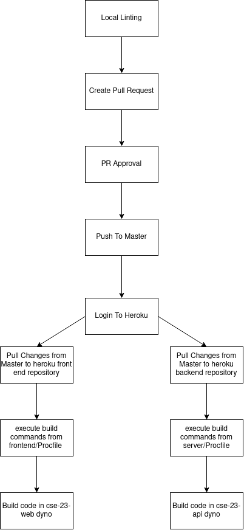

# CI / CD Pipeline 
### Linting - Functional
- Locally, we all downloaded ESLint and the config is in the packages.json file. 

### Code Review - Functional
- Codacy is downloaded unto the repository and when a pull request is submitted, Codacy automatically reviews the code that is being merged into the main branch. Commit suggestions are left on the pull request. 

### Pull Requests -Functional
- A pull request can only be merged if at least two individuals on the team review it. If it is pertinent to parts of code that other people are assigned to, then the person performing the pull request must assign those individuals to that pull request for review. 

### Unit Testing - TBD
- Right now, we don't have much planned for unit testing, but are leaning towards JsUnit. 

### Documentation Generation - In Progress
- We are utilizing JsDocs so each dev will properly comment functions and their code to the JsDoc style. Then during each build of the app, we will jsdoc all ".js" files to automatically generate our documentation. 
 
### Heroku Deployment - Functional 

- When code is pushed to master, git will run a script which logs into heroku and then with the heroku credentials, copies the code from master to the heroku front and back end repository. The Procfiles in the "/frontend" and "/server" folders of the repository determine which scripts that the frontend and backend repositories in heroku will download and build. 

